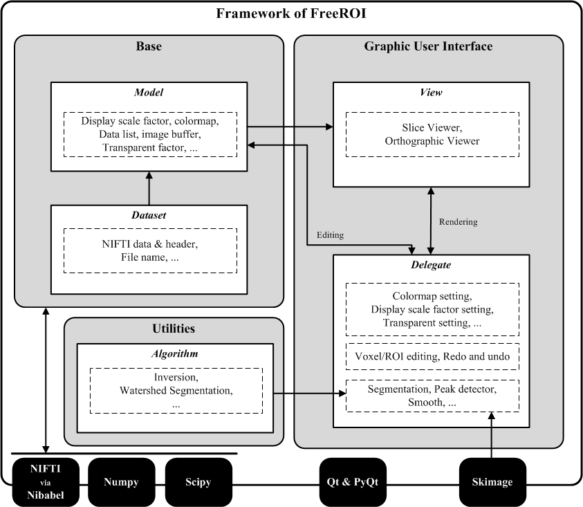

*********************
Software Architecture
*********************

Introduction
============

In order to provide an easy-to-use graphic user interface, with the 
complicated neuroimage datasets and many different image processing methods, 
**FreeROI** is developed following a Model-View-Delegate (MVD) architecture 
pattern (a modified version of 
`Model-View-Controller <http://en.wikipedia.org/wiki/Model-view-controller>`_ 
architecture) under Qt framework.

The software could be divided into three kinds of components, which are 
*model*, *view* and *delegate*. The MVD design defines the interaction 
between them.

* The **model** consists of neuroimage data, rules for image display and the 
  functions to read/modify datasets in the application. This component is
  implemented as the the module *froi.gui.component.datamodel*, and the
  basic dataset is packaged in the module *froi.gui.base.bpdataset*, which is
  used in *datamodel*.

* The **view** is used to display neuroimage data in different types of
  representation, such as in a slice-wise fashion which implemented in 
  *froi.gui.component.GridView* or displayed in three orthogonal sections
  implemented in the module *froi.gui.component.OrthView*. The parameters
  configuring display fashion, such as the order of overlapping images, 
  contrast, colormap and transparent, are showed in a list and tabular view
  integrated in the module *froi.gui.component.LayerView*.

* The **delegate** mediates input from the users' operation, converting it
  to commands for the **model** or **view**.

For details about these components, see the following section.

Module Description
==================

Bpdateset
---------
The module *bpdataset* defines the baisc data structure (VolumeDataset) -- a single 
neuroimage data (NIFTI-1 format, either 3D or 4D) and many functions used to read/modify 
the value of single voxel and related parameters for display purpose.

To illustrate the usage of class VolumeData, a toy example is present. 
::

  # import module bpdataset
  from froi.gui.base import bpdataset
  # initialize a new neuroimage dataset
  new_img = bpdataset.VolumeDataset(source='nifti-file', label_config_center)

Note: argument label_config_center is a setting class used for label display implemented
in the FreeROI.

After initialization, we could get several kinds of information from new_img, including 
the name of the data, the header and data stored in the file, and get/set many parameters
used for image display (i.e. the minimum and maximum value for display, the colormap and
the degree of transparence).

It worths noting that, in order to optimize the speed of rending, the data stored in RGBA 
format used to display is created in each instance of VolumeDataset, named _rgba_list.
While display, the RGBA data is converted into QImage format using a third-part-module
array2qimage.

Datamodel
---------
In FreeROI, the module *datamodel* implements a list model VolumeListModel to organize the
dataset. The class VolumeListModel inherits from class QAbstractListModel from PyQt4. 
Every neuroimage dataset (an instance of bpdataset) is stored in a cell of the list model.
The VolumeListModel provides several useful functions to access the dataset.

As the central part of the software, none action could be done without the 
VolumeListModel. The users give their command to the model, and model takes specific
action like change the display parameter or modify a voxel's value for one dataset. At the
same time, the model would ask other components like Viewer to cooporate with it to finish
the job. More specially, while the data in list model has been changed, the model would 
emit specific signal. The other components like Viewer would accept the signal and take 
some programmed actions. For example, if the user changed the colormap for one neuroimage
dataset, the model would emit a signal named 'repaint_slices', and the Viewer part would 
accept it and re-paint the display image based on the new colormap.

Theoriticaly, the basic dataset (the instances of bpdataset) would not communicate with
the other parts directly, except for VolumeListModel.

Image Viewer
------------
FreeROI provides two kinds of Viewer to display the image, including GridView which 
displays the image in an axial view of field slice-by-slice and OrthView which displays
image in three orthogonal points of view: axial, sagittal and coronal. Both viewers have
same interface communicating other components in FreeROI.

Parameter Viewer
----------------
As another part of the component **view**, parameter viewer provides a graphic user 
interface to display and set the display parameters for high-lighted dataset in list
model. All settings in parameter viewers would be passed to the VolumeListModel.

Toolsets
--------
FreeROI provides many kinds of image processing tools, such as several implements based 
on different algorithms in image smoothing, image segmentation and feature extraction.
All these tools form the **delegate** component in software.

Main Window
-----------
As a frame, main window combines all above parts together. It works like the 'main file' 
in codes.

