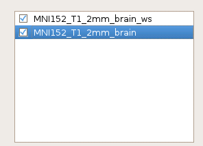
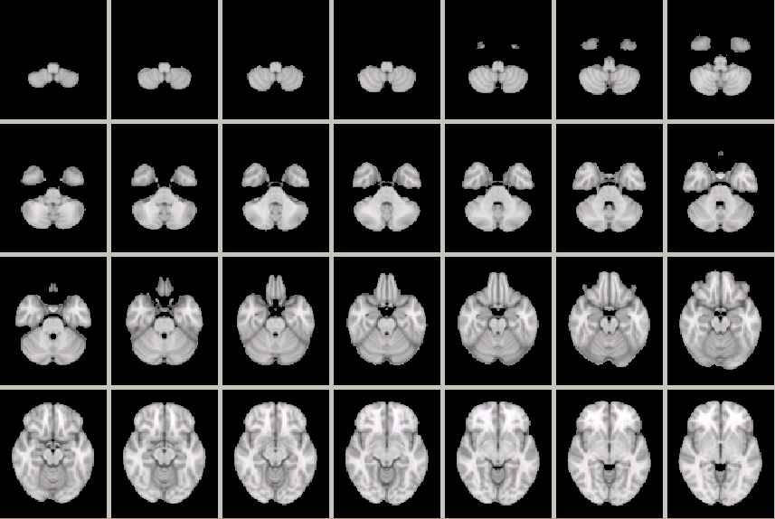
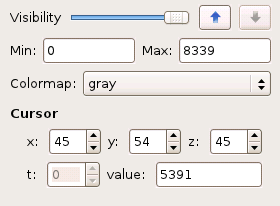
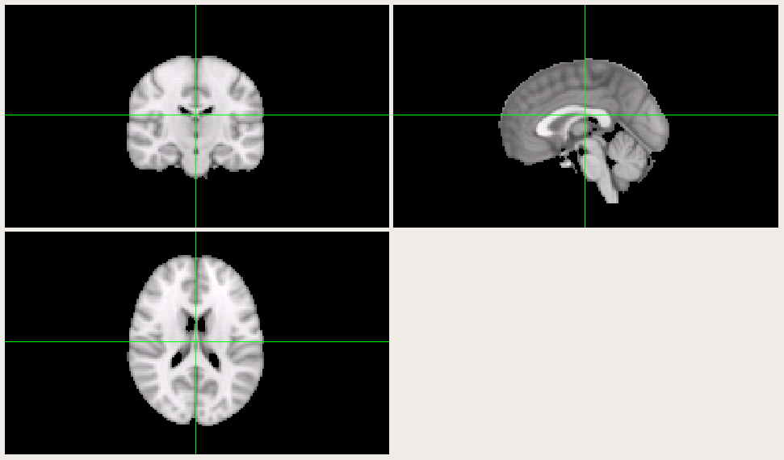

.. _data-viewing:

Data Viewing
==============

Load and save
--------------

To load an image into FreeROI, open the ``File`` menu and choose ``Add volume``.
A file viewer will appear and let you choose the file you want to load.

Once you load an image, the name of the image will show on the image list placed on the left side of the window.

There is a tickbox before each image name, only ticked images will be shown on the right window.
To rename a image, double click the name of that image in the image list.
In all the images loaded, all operations will only affect the one which has been highlighted in the list.
You could click on any image to make it the highlighted one.

To save an image which has been finished editing, first highlight it in the image list, then open ``File`` menu and choose ``Save volume as...``.
A file viewer will appear to let you choose where to save the image.
You could also specify another name for the image that differs from the its current name in the image list.

Slice view
-----------

FreeROI provides two ways for you to view and edit your image data: slice view and orthographic view.

Slice view is the default option for displaying images.
As you load an image, its data will automatically show on the slice-viewing window in the right side of the software.
The data is displayed as sliced through the inferior-to-superior axis, like this:

The number of sclice in each row can be adjusted by resize the window size of the software.

If you have load multiple images, those ticked in the image list will be overlapped into one single image to display.
You could set the order of each image in the overlap process by move the image up or down in the image list.
The transparancy could also be set by adjusting the ``Visibility`` bar under the image list.

If you want to only show data among some range in the image, you could set the minimum and maximum limit by set the values in ``Min`` and ``Max`` attribute boxes.
The colormap used for each image could also be set by choosing the prefered one listed in the ``Colormap`` list.

Orthographic view
------------------

The orthographic view is another displaying scheme to explore your data.
Unlike the slice view, the data is displayed by three slice from three different viewpoints, like this:

You could click on any of the three slices and then move the cursor to set the center point for the orthographic projection.
All other settings are similar to the slice view aforementioned.
