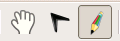
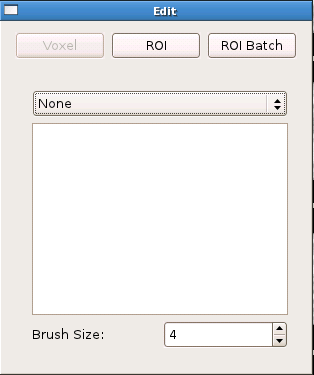
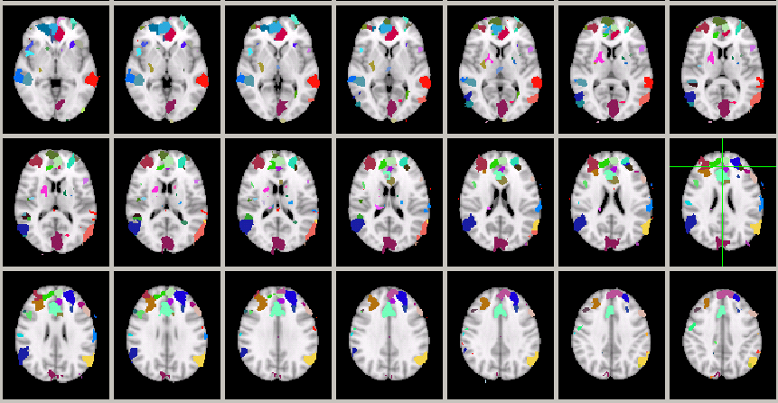
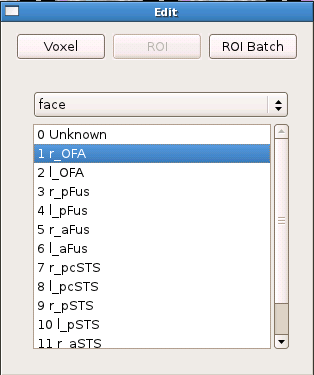
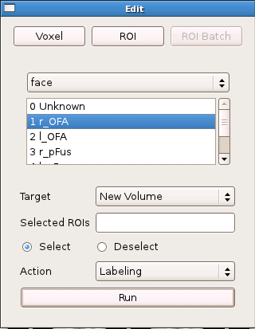
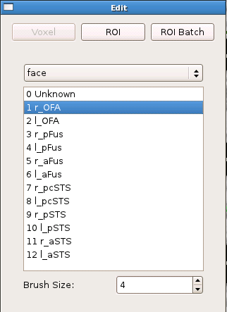
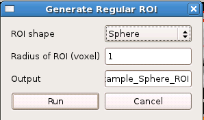

.. _roi-generation:

ROI Generation
==============

FreeROI provides three different ways to generate ROIs for neuroimaging studies.
They are designed to meet diffent kinds of requirements of ROI generating.

To generate ROI, you must first switch from the viewing mode to the edit mode, which could be done by clicking the ``Edit`` icon on the toobar:

After that, an window for controlling the editting process will show up:

The window contains two main parts: the ROI generation toolbar and the ROI label list.

ROI by handpicking subregion
-----------------------------

Generating ROI by handpicking subregion is an efficient method to reliably generate ROIs.
Its based on the idea that a fucntional ROI which defined by a set of continous voxels could usually be subdivied into small subregions.
Using these subregions, the boundary of the ROI could be reliably defined.
In contrast, if the voxels were picked one by one, the boundaries may often vary substantially and lacks objectivity.

To use this ROI generating method, first load an functional image, and then use the ``Watershed tool`` provided by the software to dividd the image into small segments, like this:

The image contains candidate small segments to be picked as the ROI.

To pick a segment and give it a label you want, first choose the label in the label list and chose ``ROI`` option in the ROI generation toolbar:

Now click on any segment in the segmented image. The segment will be labeled as the desired ROI.

There are many situations when you want to label multi-segments at once, or you want to pick the segments into another new images.
You can achieve these goals by using the ``ROI batch`` tool:

When this tool is chosen, the subregion you choose will not be labeled at once, but will only be listed in the ``Selected ROI`` box in the above image.
You could choose as many as subregions you want, and then label them all togethor by clicking the ``Run`` button.
These subregions will automatically be labelled and copied into a new image.

ROI by handdrawing
-------------------

FreeROI also provides the traditional voxel-by-voxel ROI labeling method.
To set ROI by choosing every voxel belonging to it, first set the ROI label in the label list, then click on the ``Voxel`` icon:

Now you can choose voxel freely by drawing on the image view.
You could also set the number of voxels selected one time by setting the ``Brush Size``:

Regular shape generation
--------------------------

Finally, FreeROI provides regular ROI generating methods.
Currently, FreeROI provides two kinds of regular ROI: sphere and cube.
These regular shape can be set in the ``Regular ROI`` tool:

You could choose the shape and the size of the shape, then click ``Run``, the regular shape will be generated.
