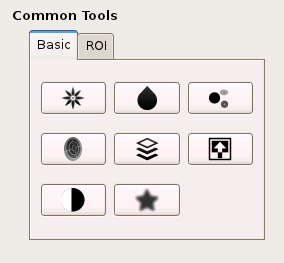
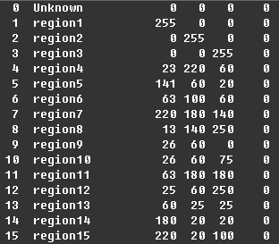

.. _data-analysis-toolkit:

Image Processing Toolkit
========================

As an integrated software suite for neuroimaging data processing, FreeROI 
not only provides the user-friendly pipeline for defining ROI, but also many
related tools for image processing, such as smoothing, binarization, and 
image segmentation.

All tools could be classified into several categories based on their
utility, and placed in the menu bar.

.. image:: imgs/menu.png

Also, many common tools are also available in the Tools Table in the
lower-left of the window.

Basic Tools
-----------

In FreeROI, the images could be binarized, smoothed, or masked by another image
by a few clicks, liberating users from complex command lines.

1. Binarization

   An image could be binarized with this tool. A threshold should be given, 
   the voxel, which value is not less than threshold, would be assigned as 1,
   otherwise, assigned as 0.

   To binarize an image, first select this image in the image list (left click
   the image, this image would be highlighted). Then, open the binarization
   tool from the tool bar or Basic Tools table on the lower-left of the window.
   Specify the threshold value and output volume name, a binarized image would
   be generated after running the tool.

   .. image:: imgs/binarization.png

#. Smoothing

   A Gaussian filter could be used for image smoothing. The parameter *sigma*
   - standard deviation for Gaussian kernel - should be specified in voxel
   units first.

   To smooth an image, first select this image in the image list (left click
   the image). Then open the smoothing tool, and specify the sigma of the
   Gaussian kernel as well as the output volume name, a smoothed image would
   be generated.

   .. image:: imgs/smoothing.png

   Note: The relationship between the *full width at half maximum (FWHM)* and
   *sigma* could be derived as FWHM = 2.3548 * sigma.

#. Inversion

   In fMRI activation image, the negative activation is usually also concerned 
   by reserchers, yet no thresholding process for negative value is implemented
   in FreeROI. To facilitate users extract regions with negative value, the 
   image could be inverted by multiplying with -1 first.

   After the source image is selected in the image list, click the *inverse*
   button, an inversed image would be generated directly.

#. Intersection

   An image could be masked by another image using intersection tool. In this
   tool, the "mask" image is selected as one of the loaded image, and binarized
   after thresholding with the lower-bound value for display. The output volume
   name is specified by users.

   .. image:: imgs/intersect.png

#. Local Maxima Detection

   This tool is used for extract local peak/maxima from an image. The local 
   peak could be used for defining ROIs with regular shape.

   To extract the local peak from an image, a least distance *min_distance*
   is needed. Peaks are the local maxima in a region of 2 * *min_distance* + 1
   (i.e. peaks are separated by at least *min_distance*).

   .. image:: imgs/local_max.png

#. Extract mean time course

   After a ROI/mask is defined, this tool could be used to extract mean time 
   course of this ROI from an 3D/4D image. 

   First, the source image should be selected from the image list. Then, open
   this tool from tool bar, and select a loaded image as the mask. The mean
   time course of this mask extracted from the source image would be exported
   to a csv file.

   .. image:: imgs/extract_mts.png

Image Edit
----------

The image could be edited in voxel or ROI unit. Click the *pen* icon on the
tool bar, the Image Edit Dialog would open.

As the goal of **FreeROI** is to generate or label ROIs, the value assigned to
each voxel is specified by a label list. Each label list consists of many
different value and the corresponding label name.

.. image:: imgs/voxel_edit.png

Select one label from ths label list, you can assign the corresponding value to
a voxel or ROI.

Also, the label list could be customized by editing a label config file. A sample
is shown here.

This file containts several rows and six columns. Each row represents a ROI.
Each column is separated by the blanks. The 1st column records the value of the
region, the 2nd records the name of the region. The other four columns represent
the R, G, B, and transparent degree while display this region in an image.

Place this file into the directory `data/labelconfig` in **FreeROI** directory,
the program would load it automatically.

1. Voxel Edit

   Select the image which you want to edit from the image list, and choose a 
   label from label list, then you can modify the value of voxel freely by
   drawing on the image.
   In addition, you could also set the number of voxels selected one time
   by setting the `Brush Size`.

#. ROI Edit

   Similar to the Voxel Edit, this tool could help you modify the value in
   ROI unit by a single click on the image.

   .. image:: imgs/roi_edit.png

#. ROI Batch

  In ROI batch, you can modify several ROIs one time, and store the modified
  ROI into a new image.

  .. image:: imgs/roi_batch.png

Image Segmentation
------------------

As the initial step for defining ROI semi-automatically, an image could be 
divided into several subregions each with a specific label using image
segmentation algorithm. In FreeROI, three segmentation methods could be used,
including *cluster detection*, *watershed*, and *region growing*.

1. Cluster Detection

   After a voxel-wise analysis, researchers usually only concern the regions
   which show a significant effect of experiment manipulation. Thus, after 
   a threshold processing, the image would consist of many separated clusters
   which defined by a set of continous voxels. With the *cluster detection*
   approach, each cluster could be extracted out and labeled with a 
   distinguishable marker.

   .. image:: imgs/clusters.png

   A threshold value should be specified in this tool.

#. Watershed

   *Watershed* algorithm could divide an image following the topographical
   information in the image. Specifically, it treats voxel value as a local
   topography (elevation). The algorithm finds local minima and "grow"
   regions around these minima by incorporating neighboring voxels in
   increasing order of voxel value, until basins attributed to different 
   markers meet on watershed lines. In addition, to segment an fMRI activation
   image, for example, the image could be inverted (multiplied with -1) before
   segmentation. The segmented image consists of several regions each with a 
   activation peak, also an activation cluster which has more than one local
   maxima would be divided into several sub-regions which are separated with
   watershed lines.

   .. image:: imgs/watershed.png

   Several parameters should be specified in this tool. First, the local minima
   could be detected automatically, or specified an image by user. Second,
   before segementation, the image could be smoothed to reduce noise effect.
   Third, a threshold value is used to control the extent of the subregions.
   Fourth, the image could be segmented following different strategies, this
   option is selected in the *Segment Function*.

#. Region Growing

   *Region growing* is a simple voxel(pixel)-based image segmentation method.
   This approach examines neighboring voxels of initial "seed point" and
   determines whether the voxel neighbors should be added to the region. The
   preocess is iterated on, in the same manner as general data clustering
   algorithm.

   The first step in region growing is to select a seed point. The initial
   region begins as the exact location of this seed. The region is then grown
   from the seed point to adjacent points depending on a similarity constraint.
   Also a region size is required from the user. The growing process is
   continued until the region size reach this upper-bound.

   .. image:: imgs/region_grow.png

ROI Tools
-----------------------

This set of tools are designed for ROI generation with regular shape, merging,
edge detection, and several other utility.

1. Merging

   When you need to pool many ROIs stored in different images together, this 
   tool could help you.

   Open the merging tool, and select the loaded images which you want to be
   merged together, a merged image would be generated.

#. Edge Detection

   This tool is used to extract the edge of the ROI. It's very useful when you
   need to display the ROI as a enclosed boundary.

   A sample is presented. In the left image, a ROI is displayed in blue, its
   edge is detected with this tool, and displayed in green color in the right.

   .. image:: imgs/edge_detect.png

#. Regular ROI

   Provided an image which contains many seed points, this tool could generate
   many ROIs with regular shape (cube or sphere) using these seeds as centers.
   The generated regular ROIs would be stored in a new image.

   .. image:: imgs/regular_roi.png

#. ROI to Surface

   It's an experimental tool which used to map a ROI to the nearest surface
   of white/gray matter. When you want to tract a fiber based on DTI data,
   this procedure could improve the quality of fiber tracting.

Morphological Processing
------------------------

Morphological image processing is a collection of non-linear operations related
to the shape or morphology of features in an image. According to
`Wikipedia <http://en.wikipedia.org/wiki/Morphological_image_processing>`_ ,
morphological operations rely only on the relative ordering of voxel/pixel
values, not on their numerical values, and therefore are especially suited to
the processing of binary images. Morphological operations can also be applied
to greyscale images such that their light transfer functions are unknown and
therefore their absolute voxel/pixel values are of no or minor interest.

1. Erosion
   Erosion is one of two fundamental operations (the other being dilation) in 
   morohological processing from which all other morphological operations are
   based. The operation could be used to reduce the extent of foreground in the
   image.

#. Dilation
   The effect of dilation is opposite to that of erosion. It would enlarge the
   extent of foreground of the image.

#. Opening
   As the combination of *erosion* and *dilation*, the opening operation is
   usually used as a basic workhorse of morphological noise removal. Opening
   removes small objects from the foreground of an image, placing them in the
   background.

